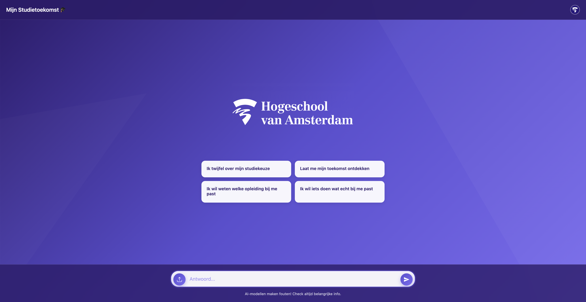

# HvA Study Coach Chatbot (MVP)

This is a minimal proof-of-concept web app designed to showcase the potential of a chatbot that helps prospective students of the Hogeschool van Amsterdam (HvA) explore study programs. The chatbot interacts with users in a friendly and informal way, asking about their interests, hobbies, and future goals, and offers tailored suggestions or guidance.

## What it does

- Engages users in a natural conversation about hobbies, passions, and aspirations.
- Suggests HvA study programs that may match the user’s interests.
- Includes an optional image upload feature: users can upload a photo of themselves, and the app uses an AI model to generate an “aged” version — a fun way to imagine their future self.
- Chat responses are powered by an AI assistant using API-based interaction.

## Screenshot



## Tech stack

- HTML/CSS/JS frontend
- Node.js backend with Express
- OpenAI Assistants API for chat responses
- OpenAI Dall-E for image generation
- Simple file upload and preview interface

## Getting Started

1. Clone the repository:
   ```bash
   git clone https://github.com:meeslindeman/hva-chat.gi
   cd hva-chat
   ```
2. Install dependencies:
   ```bash
   npm install
   ```
3. Create a `.env` file in the root directory with the following variables:
   ```bash
   OPENAI_API_KEY=your-openai-api-key
   ASSISTANT_ID=your-openai-assistant-id

   PORT=3000
   NODE_ENV=development
   ```
4. Run the development server:
   ```bash
   npm run dev
   ```

### Using Docker
```bash
git clone https://github.com:meeslindeman/hva-chat.gi
cd hva-chat
docker build -t hva-chat
docker compose up
```
